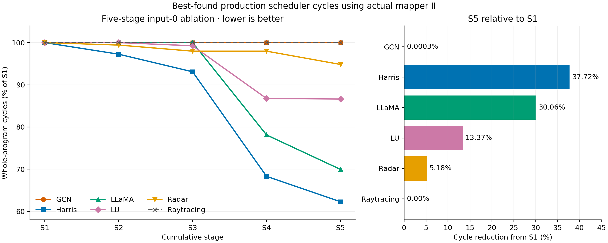

# ORBIT input-0 reproduction artifact

This repository contains the minimal inputs and final results for six fixed input-0 programs across five cumulative stages: shape with fixed dispatch, shape with critical-path dispatch, then replica, tiling, and fusion. All 30 stages completed real mapper/native replay, independent trace checks, and numerical validation.

- [Results, protocol, and limitations](docs/INPUT0_NEIGHBORHOOD_ABLATION.md)
- [Build and reproduction commands](docs/INPUT0_NEIGHBORHOOD_REPRODUCIBILITY.md)
- [ORBIT compiler source](https://github.com/guosran/orbit)
- [Final machine table](reference/input0-neighborhood/evidence/table/neighborhood-stage-table.json)

The common budget is four rounds and 1,024 unique complete candidate scores, beam width 16 with four diversity slots, and a five-candidate native shortlist plus identity/previous-winner controls. Results are best-found production scheduler cycles using actual mapper II. They do not claim exhaustive optimality or hardware/RTL wall-clock measurements. SRAM reports four passed stages and 26 pending stages; no formal full-system GO is claimed.

The bundle contains static programs and caller proofs, model weights, parent costs, required historical seed programs, independent reference sources, final C++ selections and native validation records, and PNG/SVG/PDF plots. It contains no prefilled mapping/ML caches, logs, candidate archives or checkpoints. Reproduction generates those locally in ignored directories.
