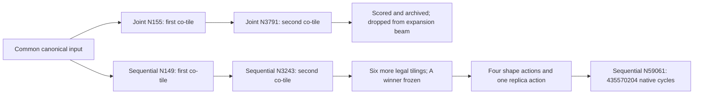

# Supplemental budget transfer and LLaMA path diagnosis

The original comparison and its predeclared fixed 50/50 main table remain
unchanged. All20 primary/sensitivity cells have now passed validation and
byte-binding audits. Across all five main workloads, the Sequential/Joint
native-cycle geometric mean is 1.005897, with wins in both directions. Their
observed Joint/Sequential search-time geometric mean is 2.352559, under
changing background load; this is a cost observation, not a controlled
efficiency result. The earlier four-program observations (about1.006 and2.07)
are superseded by this complete five-program aggregate. No assertion of
universal Joint superiority is supported.

## Separate unused-budget variant

The opt-in C++ option is
`decision-flow=sequential sequential-budget-policy=transfer-unused`.
The default policy remains `fixed-split`. The separate experiment label is
`sequential-50-transfer`, with `experiment_kind=sequential-budget-transfer-supplement`.
It cannot be placed in the original fixed-split main table by the exporter.

The total objective allowance remains 4096, including the initial production
scheduler invocation. Nominal A/B caps are 2048/2048. Only when A stops with
`no-new-legal-candidates`, unused A calls move to B:

```
transfer = nominal_A - actual_A
effective_A = actual_A
effective_B = nominal_B + transfer
```

No transfer occurs on `max-rounds`, objective-cap exhaustion, explicit pause,
or fatal contract/write errors. `no-new-legal-candidates` means exhaustion of
new legal neighbors of the retained beam, not exhaustion of the complete
graph space. Ordinary rejected schedules still consume objective calls.
The action registry, phase filtering, legal resource assignment, materializer,
freeze checks, dedup, predictor, scheduler, beam, archive, cache sharing across
A/B and A incumbent are unchanged. Each method starts with its own identical
canonical predictor seed and empty mapper cache. Final verification remains
five shortlist entries plus identity and A-anchor controls, using the same
mapper, production scheduler, independent trace and numerical checks.

This is a supplemental variant, with its additional searches, initialization,
predictions and final mapping costs reported separately. It does not replace
the original 50/50 result or select a favorable split per benchmark. The first
targets are GCN and LU: their original A phases consumed 5 and 214 calls,
respectively. Both completed supplemental flows consume exactly4096 calls:
GCN uses A5/B4091 with2043 transferred, and LU uses A214/B3882 with1834 transferred.
The newly completed Radar50/50 cell also stops A early, after2 calls (total2050);
this is recorded as the same utilization issue. The current supplemental
launch retains the requested GCN/LU focus.

The compiler delta is
`reference/sequential-comparison/compiler-budget-transfer.patch`, applied after
the prerequisite, Sequential and two runtime patches. The independent source
worktree is `.work/sequential-budget-transfer-source`, optimizer/runtime
`.work/sequential-budget-transfer`. Build provenance verifies that only
`JointNeighborhoodSearchPass.cpp` differs and that the baseline build was not
modified. Model payloads and the mapper-cost namespace remain identical to
the main cohort. Both optimizer pins are preserved.

The 32-call end-to-end validation, with the main quota512 and independent
private caches, passed all seven mapper/numeric/trace gates per cell:

| Diagnostic | A calls | B calls | Total calls | Transferred | Native cycles |
|---|---:|---:|---:|---:|---:|
| GCN fixed 50/50 | 5 | 16 | 21 | 0 | 94,151 |
| GCN transfer | 5 | 27 | 32 | 11 | 93,351 |
| LU transfer, A cap reached | 16 | 16 | 32 | 0 | 14,794 |

These small-budget numbers are implementation checks, not 4096-call results.
The new binary in default mode passed the runtime equivalence checker against
the previous GCN diagnostic: ordered attempts/frontiers/objective trajectories,
selected candidate IR, predictor counts/cache, exact mapper inputs/outputs,
aggregate mapper calls, all native cycles and numeric/trace evidence match.
Only wall timing, authenticated runtime path aliases and permitted parallel
cache attribution differ. Exact numeric script bytes must match both bound
source-contract payloads before numeric runtime paths can normalize.
Unknown allocation policies and transfer under Joint fail before evaluation.
The 25 focused Python checks pass.

Machine evidence is under
`diagnostics/sequential-comparison-4096-fast2-host/`:
`budget-transfer-smoke-audit.json`, `budget-transfer-fixed-equivalence.json`,
`budget-transfer-option-checks/checks.json`, and
`budget-transfer-queue-acceptance.json`. `diagnostic-extra-costs.json` separately
records all three smoke searches (85 objective calls, 112 actual mapper calls,
21 native program evaluations), predictor work, initialization, proof-only
path replays and the compiler build. None of this is hidden inside a main arm's
allowance. Completed smoke auxiliary files have been losslessly compacted.

The full supplement in `results/sequential-budget-transfer-4096` completed
after main completion. Its queue waited on the main supervisor's Linux process
descriptor, without polling results, and started only after successful process
exit and all20 validation/binding checks. It uses two disjoint four-CPU lanes.
Raw catalogues use the existing spill/compaction helpers.
Selected plans, numerical results, traces and raw-statistic manifests remain.
The original main process and active-run pointer are unchanged.
A second process-descriptor callback ran the exporter once after completion.
The main export passed, but the supplemental export initially failed because
its coordinator does not produce the main run's validation-sidecar filename.
The unchanged historical `auto-report.json` and `auto-report.log` record that
failure. The exporter now derives its supplemental validation audit from the
existing pre-launch queue/runtime/source-contract bindings, the identical
comparison/search input bindings, and inherited native-tool byte bindings.
It checks all frozen replay payloads and native dependencies, without
fabricating a retrospective pre-launch sidecar or rerunning any evaluations.
The manual audited export recovery is recorded in `export-recovery.json`.

Query both main and supplemental results once:

```sh
python3 /home/x/shiran/project/orbit-artifact/scripts/show_sequential_comparison.py
```

The supplemental query alone is:

```sh
python3 scripts/show_sequential_budget_transfer.py
```

It exports audited native cycles, actual A/B calls,
transferred allowance, prediction/mapper counts, time, full result records and
evaluation/wall-time prediction curves under
`diagnostics/sequential-budget-transfer-4096`. Search and final mapper budgets
remain separate. Background-load differences are retained as a timing caveat.

The completed4096-call supplement is:

| Program | Joint cycles | Fixed50/50 cycles | Transfer cycles | Transfer/Joint | Actual A+B | A/B seconds | Total search seconds | Actual final mapper calls |
|---|---:|---:|---:|---:|---:|---:|---:|---:|
| GCN | 79,801 | 85,363 | 79,710 | 0.998860 | 5+4091 | 137.745 / 8867.641 | 9010.811 | 53 |
| LU | 9,798 | 9,094 | 9,093 | 0.928047 | 214+3882 | 370.907 / 1458.949 | 1833.739 | 33 |

Cycles come from the same native5+2 validation; all14 supplemental numerical,
mapper-equality and independent schedule-trace items pass. GCN's transfer
variant lowers cycles by6.62% relative to fixed50/50 and differs from Joint
by only0.11%, eliminating the meaningful Joint lead observed with unused A
allowance. LU gains only1 cycle (0.011%) from1834 additional B calls and remains
7.20% below Joint. The original main geometric mean is not recomputed with
these selectively scoped supplemental cells.

`budget-extension-audit.json` confirms that the entire original objective
trajectory is an exact prefix of the extended run:2053 entries for GCN,
2262 for LU, including candidate IDs, scores and incumbent values. Phase-A
counters, typed action histories, resource shapes, communication edges,
task costs and native A-control cycles also match exactly. The frozen graph
prefix remains unchanged. Hence these improvements follow additional B
exploration rather than a changed A decision or warmed method cache.

For GCN the final resource suffix replaces Task_10's two replicas with a1×2
shape, adds four Task_11 replicas, and changes Task_16/17/23 to1×2; Task_9/12's
four replicas and the frozen Task_27 tiling remain. Predicted native-winner
cost falls from86,773 to81,832. For LU the tiling and eight Task_6 replicas
remain, with several shape changes; predicted/native cycles improve by only1.
Exact typed actions and resource differences are in the extension audit.

`all-cells.csv` contains candidate/legal/dedup counts, objective/cache counts,
predictor features/inferences/cache hits, phase times, initialization and
resource-legality queries, and separate final-validation mapper counts.
`additional-costs.json` records the full supplemental cost:8192 objective calls,
271,280 predictor feature queries,84,680 direct ensemble inferences,86 actual
mapper calls and14 native program evaluations, plus preparation/batch records.
The number3877 denotes extra B calls relative to the original two fixed-split
trajectories; it is not the total cost of these two freshly run supplemental
experiments. Small checks/build/proof costs remain separately recorded.

To reproduce with fresh source/pin/runtime/result namespaces, first build the
reference compiler as described in `SEQUENTIAL_COMPARISON.md` and apply both
runtime patches from `SEQUENTIAL_RUNTIME_ACCELERATION.md`, then:

```sh
git -C ../orbit worktree add --detach "$PWD/.work/sequential-budget-transfer-repro-source" 99ded7396f31c71ee0946389c6946a5f58c770c6
git -C .work/sequential-budget-transfer-repro-source apply "$PWD/reference/sequential-comparison/existing-source-prerequisite.patch"
git -C .work/sequential-budget-transfer-repro-source apply "$PWD/reference/sequential-comparison/compiler-sequential.patch"
git -C .work/sequential-budget-transfer-repro-source apply "$PWD/reference/sequential-comparison/runtime-acceleration.patch"
git -C .work/sequential-budget-transfer-repro-source apply "$PWD/reference/sequential-comparison/runtime-materializer-proof-cache.patch"
git -C .work/sequential-budget-transfer-repro-source apply "$PWD/reference/sequential-comparison/compiler-budget-transfer.patch"
python3 scripts/build_sequential_runtime_acceleration.py \
  --baseline-build /tmp/orbit-sequential-build-final \
  --source-root .work/sequential-budget-transfer-repro-source \
  --work-dir /tmp/orbit-sequential-budget-transfer-repro-build \
  --optimizer .work/sequential-budget-transfer-repro/bin/mlir-amoeba-opt
python3 scripts/prepare_sequential_budget_transfer.py \
  --artifact-root "$PWD" --base-runtime .work/sequential-source-bound-runtime \
  --base-contract .work/sequential-comparison-fast2/source-model-contract.json \
  --source-root .work/sequential-budget-transfer-repro-source \
  --runtime-root .work/sequential-budget-transfer-repro
python3 scripts/run_sequential_budget_transfer.py \
  --main-results-root results/sequential-comparison-4096-fast2-host \
  --runtime-root .work/sequential-budget-transfer-repro \
  --output-root results/sequential-budget-transfer-4096-repro \
  --staging-root /tmp/orbit-sequential-catalogues-budget-transfer-repro
```

The already-created frozen runtime can reproduce the accepted small checks
using its recorded `.work/sequential-budget-transfer/smoke-plan.json` commands
with fresh output roots. The full queue launch vector is retained in
`results/sequential-budget-transfer-4096/queue-launch.json`.

## LLaMA: a retained graph prefix lost its expansion opportunity

Both original LLaMA flows use all 4096 objective calls. Final native cycles
are 479,470,611 for Joint and 435,570,204 for Sequential 50/50, a 9.156% reduction
for Sequential. Its winner `neighborhood-59061` has eight graph actions:
two factor-two producer/consumer co-tilings and six regular tilings (five
factor-two, one factor-four). It has no fusion. The resource suffix sets
Task_7 to 2×2, Task_8 to eight replicas along axis zero, Task_6 to 1×3, and
Task_5 and Task_4 to 1×2. Replica expansion yields 28 physical tasks. Full typed
parameters, selected shapes, dependencies and native traces remain in the
original result and supplemental evidence, not just these action counts.

Comparing all 1426 Joint graph witnesses with the Sequential final graph finds
zero canonical-equivalent complete graphs and zero graph/resource matches.
Comparison expands each run-local graph/body ID into canonical structural
facts, ordered exact typed-kernel-body bytes and partition lineage facts;
resources and any active-transfer proof are then compared. This is the
existing dedup equivalence, not a claim about every possible semantic
reformulation of the program. All read archive members are checked against
their recorded SHA256 and sizes. The tar digest is computed as an audit
identity; the historical manifest binds its size and individual member bytes.

The exact typed-action path has a common two-step prefix:

| Prefix | Sequential candidate | Joint candidate | Predicted makespan |
|---|---|---|---:|
| co-tile Task_1 and Task_3 ×2 | neighborhood-149 | neighborhood-155 | 988,800,132 |
| then co-tile Task_0 and Task_3.tile.0.1 ×2 | neighborhood-3243 | neighborhood-3791 | 902,494,473 |

`neighborhood-3791` is valid and successfully scored. It is the 64th valid
round-1 child, ranked44 among the 64 children scored so far. Generated-beam selection reserves
12 cost slots and at most4 additional distinct last-action/shape configurations;
those diversity slots were already occupied by higher-priority candidates.
It was removed from the expansion beam immediately, remained in the permanent
archive, and never became a round-2 parent. Its full-round cost rank is113.
In the actual incremental selection input (16 retained candidates plus the new
candidate), it ranked17 of17. Incremental retention was checked against a
fresh selection from all scored children at every prefix of rounds0/1.
The reconstructed round-2 parent set (15 selected children plus canonical
identity) matches the actual archive exactly. Round quota512 did not prevent
this candidate's evaluation.

This identifies a search-path coverage failure: a legal graph prefix lost its
opportunity to grow before the later resource decisions became available.
It does not establish that all alternative paths to the final graph were
impossible or that every intermediate prediction was accurate. The final
Sequential winner's prediction375,640,343 is better than the final Joint
winner's prediction430,562,651, agreeing with native ordering; the final winner
was absent from Joint's explored set, rather than present and ranked below
the Joint winner by the final objective.



The existing `--replay-joint-neighborhood-actions` pass successfully replays
prefixes2/3/8 and the full13 actions, with current source partition proof and
the same cap8. It runs no predictor, scheduler or mapper. This pass checks the
post-initial menu (`round=1` at every step), so it proves materialization/proof
reachability, not original per-round beam or budget reachability. The beam
reconstruction supplies the evidence for the actual Joint divergence.

Reproduce the archive audit and action replay without increasing Joint budget:

```sh
taskset -c 8 python3 scripts/diagnose_llama_sequential_path.py
taskset -c 8 python3 scripts/replay_sequential_winner_path.py \
  --cell results/sequential-comparison-4096-fast2-host/llama/sequential-50 \
  --output-dir diagnostics/llama-path-replay-repro --prefix-lengths 2 3 8
```

Evidence is under
`diagnostics/sequential-comparison-4096-fast2-host/llama-path-diagnosis` and
`llama-path-replay`. The original action-attempt logs lack candidate/parent/
round IDs. They cannot assign global failed attempts to a specific parent;
this diagnosis uses valid archived states and the pinned beam algorithm.

A factual paper claim at this point is: joint search benefits some programs,
while strong graph-then-resource search remains competitive at the same
objective-call allowance. Outcomes depend on budget allocation and which
intermediate states retain expansion opportunities. LLaMA provides a concrete
example of beam selection discarding a useful legal graph prefix. These
results motivate improving exploration of the joint space, not asserting
that merely exposing more decisions guarantees better search results.

The complete native main table and all split sensitivities, search/predictor/
mapper counts, preparation/restart costs, convergence curves, selected plans,
numerical evidence and final trace index are in
`diagnostics/sequential-comparison-4096-fast2-host/results.{json,md}` and
`final-artifact-index.json`. `native-five-program-aggregate.json` records the
five-program geometric means without mixing predicted and native cycles.
